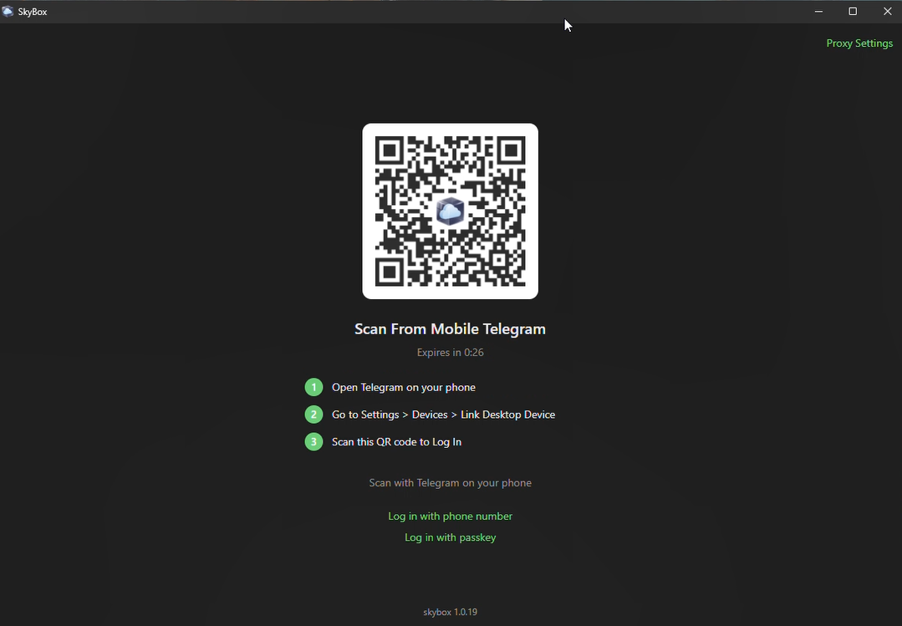
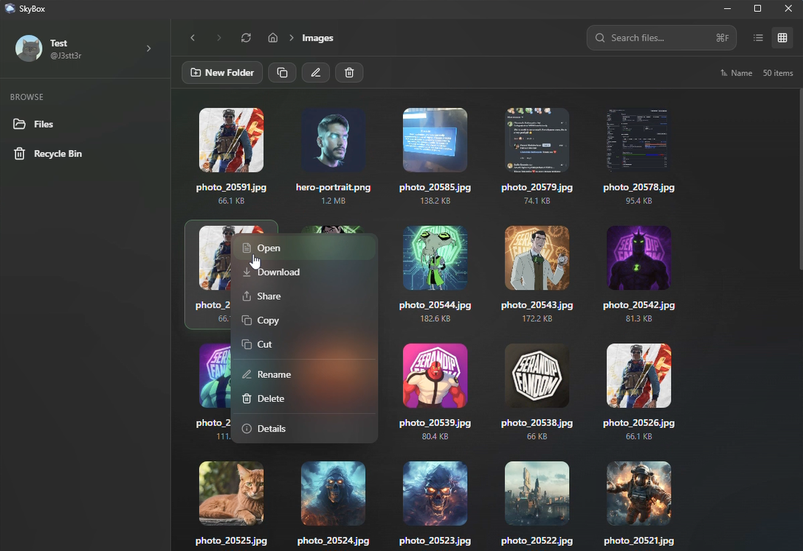
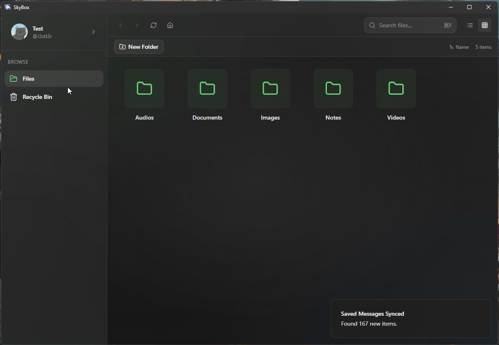
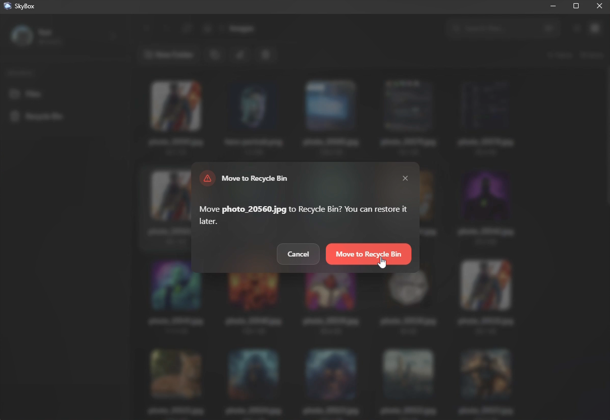
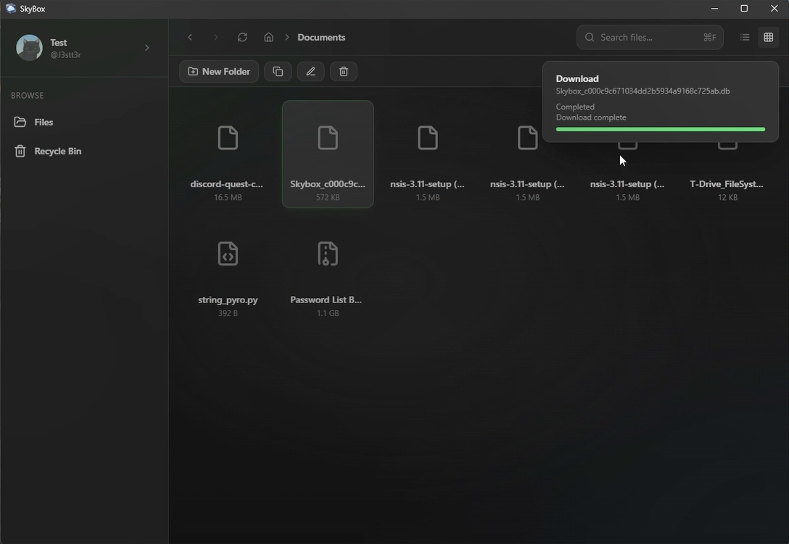
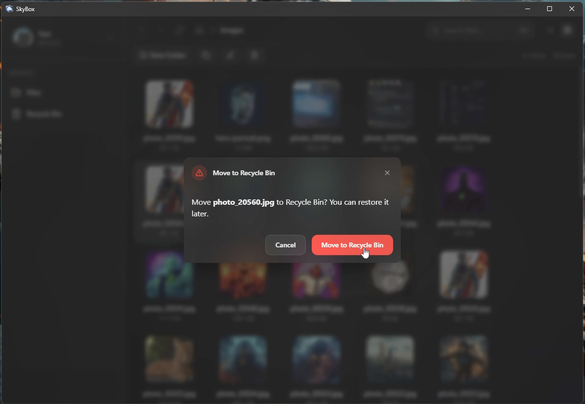

<div align="center">

# SkyBox


A Tauri-based file explorer application with Telegram integration

</div>

## Download

### Latest Release: v1.0.21

| Platform         | Download                                                                                                              |
| ---------------- | --------------------------------------------------------------------------------------------------------------------- |
| Windows (MSI)    | [Download](https://raw.githubusercontent.com/TG-SkyBox/SkyBox/download/1.0.21/SkyBox%20Desktop_1.0.21_x64_en-US.msi)  |
| Windows (NSIS)   | [Download](https://raw.githubusercontent.com/TG-SkyBox/SkyBox/download/1.0.21/SkyBox%20Desktop_1.0.21_x64-setup.exe)  |
| macOS (DMG)      | [Download](https://raw.githubusercontent.com/TG-SkyBox/SkyBox/download/1.0.21/SkyBox%20Desktop_1.0.21_aarch64.dmg)    |
| Linux (AppImage) | [Download](https://raw.githubusercontent.com/TG-SkyBox/SkyBox/download/1.0.21/SkyBox%20Desktop_1.0.21_amd64.AppImage) |
| Linux (DEB)      | [Download](https://raw.githubusercontent.com/TG-SkyBox/SkyBox/download/1.0.21/SkyBox%20Desktop_1.0.21_amd64.deb)      |

---

## Tech Stack

- **Frontend**: React, TypeScript, Tailwind CSS
- **UI Components**: shadcn/ui, Radix UI
- **Backend**: Rust (Tauri)
- **Build Tool**: Vite
- **Testing**: Vitest, Testing Library
- **Platform**: Desktop (Windows, macOS, Linux)

## Why This Project Exists

- **Problem**: Cloud storage services cost money and have storage limits, while users need free unlimited storage for their files
- **Goal**: Create a file explorer that uses Telegram as unlimited free cloud storage for seamless file backup and sharing
- **Outcome**: A native desktop application that turns Telegram into personal cloud storage while providing modern file management capabilities

## Project Structure

```
src/
├── components/         # React components
│   ├── skybox/         # SkyBox-specific components
│   └── ui/             # shadcn/ui components
├── hooks/              # Custom React hooks
├── lib/                # Utility functions
├── pages/              # Application pages
├── test/               # Test setup and examples
├── App.tsx             # Main application component
└── main.tsx            # Application entry point

src-tauri/
├── src/                # Rust backend code
│   ├── db/             # Database operations
│   ├── fs/             # File system operations
│   ├── telegram/       # Telegram integration
│   ├── utils/          # Utility functions
│   ├── lib.rs          # Library exports
│   └── main.rs         # Tauri entry point
├── capabilities/       # Tauri permissions
├── icons/              # Application icons
├── Cargo.toml          # Rust dependencies
└── tauri.conf.json     # Tauri configuration

public/                 # Static assets
screenshots/            # Application screenshots
docs/                   # Documentation
.github/workflows/      # CI/CD workflows
README.md
package.json
vite.config.ts
tsconfig.json
tailwind.config.ts
```

<h2 align="center">Screenshots</h2>

<p align="center">
  
  
  
  
  
  
</p>

## Key Features

- Browse and manage files with a modern, responsive interface
- Search files and folders quickly
- Integrate with Telegram for seamless file sharing
- Access files across Windows, macOS, and Linux platforms
- Navigate using an intuitive breadcrumb system
- View file details in a dedicated panel
- Manage files through a grid or list view
- Secure local data storage with SQLite

## Contributing

We welcome contributions to SkyBox! Here's how you can get involved:

### Prerequisites

- Node.js (latest LTS version recommended)
- Rust (1.77.2 or later)
- npm or bun package manager
- Git

### Development Setup

1. **Clone the repository:**

   ```bash
   git clone https://github.com/pamod-madubashana/SkyBox.git
   cd SkyBox
   ```

2. **Install dependencies:**

   ```bash
   npm install
   ```

3. **Run the development server:**

   ```bash
   npm run tauri:dev
   ```

   This will start the Vite development server and launch the Tauri application in development mode.

4. **Alternative development commands:**
   - Frontend only: `npm run dev`
   - Build frontend: `npm run build`
   - Run tests: `npm run test`
   - Run linter: `npm run lint`

5. **Rust-specific development:**
   - Navigate to `src-tauri/` directory for Rust-specific commands
   - Format Rust code: `cargo fmt`
   - Lint Rust code: `cargo clippy`
   - Run Rust tests: `cargo test`

### Project Structure

The project follows a typical Tauri application structure:

- `src/` - Contains the React frontend code
- `src-tauri/` - Contains the Rust backend code
- `src/components/` - Reusable UI components
- `src/pages/` - Application pages/routing components
- `src-tauri/src/telegram/` - Telegram integration logic
- `src-tauri/src/db/` - Database operations

### Coding Guidelines

- Use 2-space indentation for TypeScript/JavaScript
- Use PascalCase for components and interfaces
- Use camelCase for variables and functions
- Use SCREAMING_SNAKE_CASE for constants
- Follow the existing code style in the respective files
- Write meaningful commit messages using conventional prefixes (feat:, fix:, refactor:, etc.)

### Pull Request Process

1. Fork the repository
2. Create a feature branch (`git checkout -b feature/amazing-feature`)
3. Make your changes
4. Ensure your code follows the style guidelines
5. Submit a pull request with a clear description of your changes
